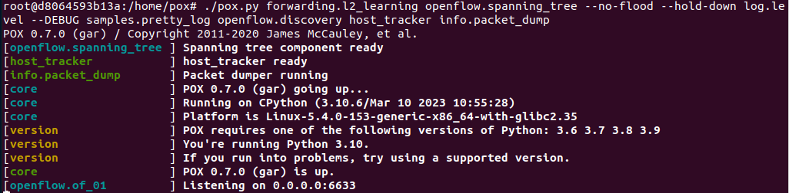

# pox_mininet_tutorial
In this tutorial, we will explore the process of installing the POX controller, establishing a network topology using Mininet, and performing various network operations such as pinging between hosts and observing the output. The tutorial assumes that you have already configured your Mininet virtual machine (VM) in VirtualBox. If you haven't done so, please ensure you complete the setup before proceeding further. By the end of this tutorial, you will have a clear understanding of setting up the POX controller, creating network topologies in Mininet, performing network operations, and exploring solutions to mitigate delays in network links. Let's get started!

# Pox Controller
I assume that you have already configured your Mininet VM in VirtualBox, proceed with the following steps.

1. Download Pox controller from [here](https://github.com/noxrepo/pox)

2. Rename the root directory as 'pox' and transfer the downloaded files to your Mininet virtual machine.

3. Assuming the you have placed the Pox controller files on the VM Desktop, navigate to the root directory 'pox' using the command line in the VM.
```bash
cd Desktop/pox/
```

4. The root directory contains all the necessary files for running the Pox controller. To initiate the controller, we will execute the Python file `./pox.py`. Once the SDN controller is operational, it establishes communication with the connected OpenFlow switches and generates a forwarding table. The complete forwarding logic is implemented in a Python file located within the `pox/forwarding/` directory (assuming that you are in the root directory). This directory contains several script files, but we will specifically use `l2_learning.py` file. Open this file and have a look at the code, where you will find detailed comments explaining the forwarding algorithm.

5. In the command line, run the following command, which will start the pox SDN controller inside the VM.
```bash
./pox.py forwarding.l2_learning openflow.spanning_tree  --no-flood --hold-down log.level --DEBUG samples.pretty_log \
 openflow.discovery host_tracker info.packet_dump
```

6. The above command will start the pox controller, and you will see the output on the display similar as in the image below.

Figure 1: POX controller initial status

7. This basically shows that controller has now started and will listen on port `6633` for status messages from the attached swithces.

8. Keep in mind that currently we have only established an SDN controller. Now, we will proceed with creating the remaining topology and connecting the switches to the controller in the Mininet simulation.

# Mininet Simulation

Open a putty session to your VM in which you will run the mininet simulation. Now, for a demo, we will create a simple topology as shown in the image below. 

Figure 2: SDN Topology

This topology consists of a pox controller, denoted as `c`, connected to five openflow switches: `S1, S2, S3, S4, and S5`. Additionally, there are two fog nodes, `F1 and F2`, and one host, `H1`. By default, all the links in the topology have the same assigned parameters, such as bandwidth and delay. To implement this topology, you can create a new Python file named `customtopology.py` and include the following code.

```python
from mininet.net import Mininet
from mininet.log import lg, info
from mininet.cli import CLI
from mininet.node import RemoteController
from mininet.node import OVSSwitch
from mininet.node import Host
from mininet.link import Link, TCLink
import time

def my_network():
	net = Mininet(controller=RemoteController, switch=OVSSwitch, link=TCLink)

	info( '*** Starting controllers\n')
	c = net.addController('c0',
                      controller=RemoteController,
                      ip='127.0.0.1',
                      protocol='tcp', port=6633)

	info('*** Adding switches \n')
	s1 = net.addSwitch('s1')
	s2 = net.addSwitch('s2')
	s3 = net.addSwitch('s3')
	s4 = net.addSwitch('s4')
	s5 = net.addSwitch('s5')

	info('*** Adding host and fog servers \n')
	h1 = net.addHost('h1',  ip = '10.0.1.1')
	f1 = net.addHost('f1',  ip = '10.0.2.1')
	f2 = net.addHost('f2',  ip = '10.0.3.1')

	info('*** Adding links\n')
	net.addLink(s1, h1)
	net.addLink(s1, s2)
	net.addLink(s1, s3)
	net.addLink(s1, s4)
	net.addLink(s3, s4)
	net.addLink(s3, s5)
	net.addLink(s4, s5)
	net.addLink(s5, f2)
	net.addLink(s2, f1)

	net.build()
	c.start()
	net.start()
	s1.start([c])
	s2.start([c])
	s3.start([c])
	s4.start([c])
	s5.start([c])
	time.sleep(5)
	CLI(net)
	net.stop()
	exit()


lg.setLogLevel('info')
my_network()
```

The code above sets up the network topology shown in Fig.1 using the Mininet library. Below, I will walk through the code.

1. The function `my_network()` is defined to create and configure the network topology.

2. Within `my_network()` function:
    - An instance of the Mininet network is created with a remote controller `c`, OVS switches, and TCLink links.
    - Controller `c` and switches are added to the network.
    - Host `h1` and fog servers `f1, f2` are added to the network.
    - Links are established between the switches, host, and fog servers.

3. The network is built, the controller is started (which is to connect with our POX controller), and the switches are connected to the controller.

4. A brief delay of 5 seconds is introduced for stability.

5. The user is provided with a command-line interface (CLI) to interact with the network.

6. After the user finishes interacting with the network, the network is stopped and the program exits.

7. The log level for Mininet is set to "info" for logging purposes.

So the whole code above is to configure and start the network using the simple topology shown in Fig.1, allowing the user to interact with it through a command-line interface (CLI). To execute `customtopology.py` in Mininet, copy it to your VM, and then run the following command.

```bash
mn --custom customtopology.py
```

After the command is executed, you will see a similar output as in the image below.


Figure 3: Mininet starts the network

Once the network is initiated, you will observe that the POX controller begins its learning process. The output will be similar as below.


Figure 4: Pox output messages as it starts learning 

# A Simple Task: Pinging the fog servers from the host

Considering the simple topology illustrated in Figure 2, we can proceed by sending four ping packets from `h1 to f1` and examining the resulting output. Similarly, we will send four ping packets from `h1 to f2` to observe the outcomes. We will enter the following command in Mininet CLI.

Host `h1` to ping fog server `f1`:
```bash
h1 ping -c 4 f1
```

After the execution of the commad, the ping output in the image below provides information about the success of the packet transmission.


Figure 5: Mininet ping output, h1 pings f1

The ping output represents the results of four ICMP (Internet Control Message Protocol) echo request packets sent from host `h1` to destination `f1` (IP address 10.0.2.1). 

`64 bytes from 10.0.2.1: icmp_seq=1 ttl=64 time=24.6 ms`: This line indicates the successful reception of the first ICMP echo reply from the destination IP address (10.0.2.1). It also shows the ICMP sequence number (icmp_seq=1), the time to live (ttl=64), and the round-trip time (time=24.6 ms).

After the ping packets are transmitted, the output provides the following summary statistics:

- `4 packets transmitted, 4 received, 0% packet loss, time 3037ms`: This line shows the total number of packets transmitted and received during the ping operation. In this case, all four packets were successfully received without any loss. The time indicates the total duration of the ping operation.

- `rtt min/avg/max/mdev = 0.107/6.409/24.642/10.529 ms`: This line represents the minimum, average, maximum, and mean deviation of the round-trip times (RTT) for the transmitted packets. In this case, the minimum RTT is `0.107` ms, the average RTT is `6.409` ms, the maximum RTT is `24.642` ms, and the mean deviation is `10.529` ms.

In contrast, when you initiate the ping command in Mininet, the POX controller will display output messages as shown in the image below.


Figure 6: Pox output, h1 pings f1

The output messages in Fig.6 indicates the installation of flow entries in the forwarding table of the POX controller. The flows are established between different MAC addresses, indicating the mapping of source `h1` and destination `f1` addresses for communication. Additionally, the output displays the dump of various network protocols such as Ethernet, ARP, IPv4, ICMP, and echo. The size of the transmitted packets is also mentioned. This shows the dynamic management of network flows and the handling of different protocols during the Mininet ping command, providing insights into the controller's functioning and packet routing processes.

A similar ping can be tested for the second fog server `f2' 

Host `h1` to ping fog server `f2`:
```bash
h1 ping -c 4 f2
```

The observed ping statistics for this case would resemble the previous one as shown in the image below. 


Figure 7: Mininet ping output, h1 pings f2

These results indicate that both fog servers are reachable from the host in our custom network. Also, note the Average Round-Trip Time (RTT) for both cases. RTT is a measure of the time it takes for a packet to travel from the source to the destination and back. In the given context, there are two cases with different average RTT values: `6.409ms` and `7.483ms`, which are approximately similar. The average RTT provides insights into the network latency or delay experienced during the communication between the host and the fog servers. A lower RTT indicates a more responsive network with shorter delays, while a higher RTT suggests potential network congestion or delays in the communication path. In this scenario, the nearly similar average RTT values in both cases suggest that the network exhibits comparable responsiveness and delay characteristics for the given communication between the host and the fog servers. It implies that the overall network performance, in terms of latency, is consistent for both scenarios.

# Adding Delay in the Network

In this task, we will introduce a delay to a specific link and observe the corresponding response of the ping operation. Refer to Figure 2, which shows our custom topology, and follow the paths from `h1` to `f2`. The two different possible intermediate paths are: `h1-s1-s3-s5-f2` and `h1-s1-s3-s4-s5-f2`. Now, lets add a small delay of `10ms` in a link `s3-s5` in our `customtopology.py` file. Replase the line `net.addLink(s3, s5)` with the following:

``` python
net.addLink(s3, s5, cls=TCLink, intfName1='s3-eth3', intfName2='s5-eth1', delay='10ms')
```

Now, exit Mininet and restart the topology. Afterward, initiate a ping command from `h1` to `f2` to test the connectivity between them.

```bash
mn --custom my_topo.py
```

```bash
h1 ping -c 4 f2
```

The output of the ping will be similar to the image below.


Figure 7: Mininet ping output, h1 pings f2, after introducing a delay of 10ms in a link s3-s5.

Comparing this ping command output with the previous one (without the link delay), the notable difference is the average RTT value. With the introduced delay, the average RTT has increased to `35.037` ms, whereas in the previous case it was lower, `7.483` ms. This indicates that the delay in the link has caused an overall increase in the round-trip time, leading to longer latency in the communication between `h1` and `f2`.

## How to avoid the link with the delay? 

To avoid the link with the delay in this simple toplogy, and redirect the packets to the alternative link `s3-s4-s5`, a modification to the Pox controller code, specifically the `l2_learning.py` file would be required. The specific modification required in `l2_learning.py` would involve altering the forwarding logic or implementing a routing algorithm that directs traffic from source to destination via the desired link. In this case, adjusting the code to prioritize the `s3-s4-s5` link over the link with the delay would be required.

## Solution 1: Priority Queuing Algorithm

The Priority queuing algorithm in the POX controller can provide a solution to avoid links with delays. This algorithm involves assigning different priority levels to network traffic based on specific criteria, such as packet type, source, destination, or specific network conditions. By implementing priority queuing in the POX controller, you can prioritize packets that need to avoid links with delays. In the context of the given topology, you can assign a higher priority to packets that need to traverse the alternative link (`s3-s4-s5`) instead of the link with the delay.

The controller can then use this priority information to make forwarding decisions. When packets arrive at the controller, it can examine their priority and select the appropriate forwarding path based on the desired criteria. In this case, the controller would choose the `s3-s4-s5` link over the link with the delay for packets with the higher priority assigned. Therefore, the POX controller can effectively control the forwarding path selection and route packets through the desired links, allowing avoidance of the links with delays. This can help optimize network performance, reduce latency, and ensure that critical traffic avoids any links with high delays.


## Solution 2: Optimal Fog Server Placement

Optimal Fog server placement can be another solution to avoid delays in the link. By strategically placing the fog server (`f2`) in a location where the link delays can be minimized or eliminated, the network can achieve improved performance and reduced latency. To implement this solution, you need to analyze the network topology and identify alternative placement options for the fog server. Look for locations where the link delays are minimal or where direct connections with low-latency links are available.

Once you have identified a suitable placement for the fog server, you can physically or logically position it in that location within the network topology. By doing so, the communication between the host (`h1`) and the fog server (`f2`) can bypass the link with the delay altogether, resulting in faster and more efficient transmission of packets. Optimal Fog server placement allows for a more direct and efficient path between the communicating entities, reducing the impact of delays and enhancing the overall network performance. This approach optimizes the network design by strategically placing resources to mitigate latency and improve the end-to-end communication experience.
